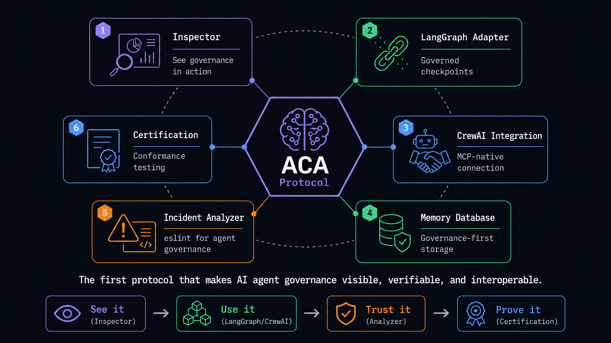
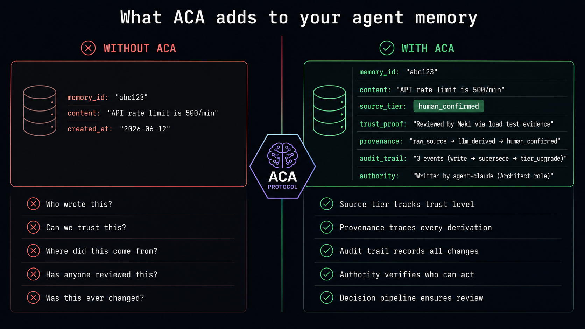
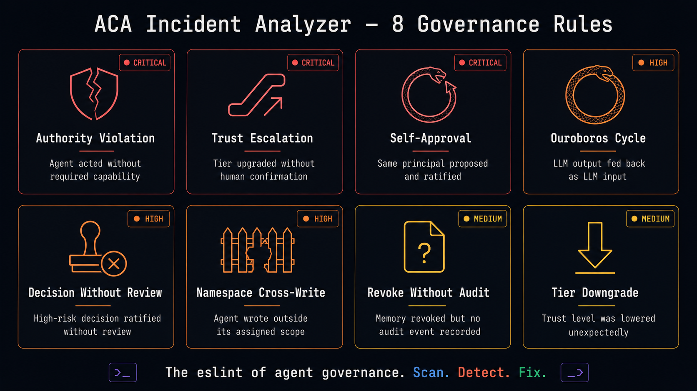
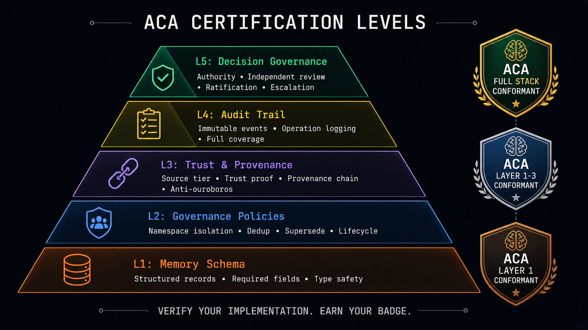

# Agent Memory Hall

> Reference implementation of [Agent Civilization Architecture](https://github.com/MakiDevelop/agent-civilization-architecture) — the first protocol that makes AI agent governance **visible**, **verifiable**, and **interoperable**.



## The Problem

AI agents can call tools (MCP), talk to each other (A2A), and be authorized (Agent Identity). But there is no standard for how agents **remember** — or how to govern what they remember.

Every agent framework invents its own memory — Mem0, Zep, Letta, LangChain Memory, custom vector stores. None of them track **who wrote it**, **where it came from**, **whether it's trustworthy**, or **who approved it**.



## What AMH Is — and What It Is Not

**AMH is an interchange, governance, and audit protocol.** It defines how memory records are represented, trusted, transferred, reviewed, and audited across agents, tools, teams, and runtimes.

AMH does **not** replace your vector database, decide what to remember, or specify embedding formats. Think of it this way: MCP doesn't tell you which tools to build. AMH doesn't tell you what to remember. It tells you how to **write it down so others can read it — and trust it**.

## ACA Ecosystem

| Package | Description |
|---------|-------------|
| [`@chibakuma/agent-memory-hall`](packages/core) | Core protocol + MCP server + CLI |
| [`@chibakuma/aca-inspector`](packages/inspector) | Web UI — governance visualization |
| [`@chibakuma/aca-langgraph`](packages/langraph) | LangGraph.js checkpointer with ACA governance |
| [`@chibakuma/aca-incident-analyzer`](packages/incident-analyzer) | Governance linter — 8 detection rules |
| [`@chibakuma/aca-certification`](packages/certification) | Conformance test suite — 5-layer certification |
| [CrewAI Integration](packages/core/docs/crewai-integration.md) | MCP-native connection guide |

## Core Schema (v0.1)

```json
{
  "amh_version": "0.1",
  "memory_id": "mem_001",
  "status": "active",
  "agent_id": "planner-agent",
  "namespace": "project:acme",
  "memory_type": "decision",
  "content": {
    "format": "text/plain",
    "value": "Use PostgreSQL for the user store."
  },
  "source": {
    "type": "agent",
    "ref": "session:2026-06-15-arch-review",
    "tier": "llm_derived"
  },
  "trust_proof": {
    "tier": "human_confirmed",
    "confirmed_by": "maki",
    "confirmed_at": "2026-06-15T14:00:00Z",
    "evidence_ids": ["review-001"],
    "method": "human_review"
  },
  "provenance_chain": {
    "origin": { "memory_id": "mem_000", "agent_id": "researcher", "tier": "raw_source" },
    "transitions": [
      { "type": "tier_upgrade", "from_memory_id": "mem_000", "to_memory_id": "mem_001", "tier_before": "raw_source", "tier_after": "human_confirmed" }
    ]
  },
  "created_at": "2026-06-15T09:30:00Z",
  "created_by": "planner-agent"
}
```

## Quick Start

```bash
# Start AMH as an MCP server (Claude Desktop / Cursor / Codex)
npx @chibakuma/agent-memory-hall

# CLI examples
npx @chibakuma/agent-memory-hall write --agent planner --ns project:acme --type decision "Use PostgreSQL"
npx @chibakuma/agent-memory-hall read --ns project:acme
npx @chibakuma/agent-memory-hall status

# Launch ACA Inspector (Web UI)
npx @chibakuma/agent-memory-hall inspector
```

Add to your MCP client config:

```json
{
  "mcpServers": {
    "agent-memory-hall": {
      "command": "npx",
      "args": ["@chibakuma/agent-memory-hall"]
    }
  }
}
```

### Configuration (`~/.amh/config.json`)

```json
{
  "store": "sqlite",
  "store_path": "~/.amh/memory.db",
  "caller_namespace": "project:acme",
  "governance": {
    "dedup": true,
    "anti_ouroboros": true,
    "namespace_isolation": true,
    "write_gate": true
  }
}
```

## Built-in Governance

| Feature | What it does |
|---------|-------------|
| **source_tier** | `raw_source` / `llm_derived` / `human_confirmed` — tracks trust level |
| **trust_proof** | Evidence-based verification record for tier upgrades |
| **provenance_chain** | Full derivation history — who changed what, when, why |
| **write-gate** | Pre-write checks: dedup, namespace, source tier |
| **content_hash dedup** | BLAKE3 hash; rejects duplicate active content per namespace |
| **namespace isolation** | Scoped read/write when `caller_namespace` is set |
| **lifecycle** | `valid_until` records filtered on read by default |
| **audit trail** | Immutable append-only event log for every operation |

## ACA Inspector

Launch the governance visualization Web UI:

```bash
amh inspector              # Default SQLite store
amh inspector --port 8080  # Custom port
```

Overview dashboard, Decision Inspector (authority + reviews + provenance DAG + audit trail), Memory Explorer (table + filters + detail drawer).

## ACA Incident Analyzer



Scan your ACA store for governance violations:

```typescript
import { analyzeIncidents } from "@chibakuma/aca-incident-analyzer";

const report = analyzeIncidents({ memories, auditEvents, decisions, assignments });
// report.incidents → authority violations, trust escalation, ouroboros cycles, ...
```

8 rules: Authority Violation | Trust Escalation | Self-Approval | Ouroboros Cycle | Decision Without Review | Namespace Cross-Write | Revoke Without Audit | Tier Downgrade

## ACA Certification



Verify your implementation against the ACA protocol:

```bash
aca-certify                          # Test default store
aca-certify --layers L1,L2,L3       # Test specific layers
```

Three conformance levels:
- **ACA Layer 1 Conformant** — Memory schema validated
- **ACA Layer 1-3 Conformant** — Schema + governance + trust/provenance
- **ACA Full Stack Conformant** — All 5 layers including decision governance

## LangGraph Integration

```typescript
import { AcaCheckpointSaver } from "@chibakuma/aca-langgraph";

const saver = new AcaCheckpointSaver({
  agentId: "my-agent",
  namespace: "project:research",
  defaultTier: "llm_derived",
});
// Every checkpoint gets source_tier, provenance_chain, and audit trail
```

## CrewAI Integration

CrewAI natively supports MCP — connect directly to AMH:

```python
from crewai.mcp import MCPClient, StdioTransport

mcp = MCPClient(transport=StdioTransport(
    command="npx",
    args=["agent-memory-hall", "serve"]
))
```

See [full guide](packages/core/docs/crewai-integration.md).

## MCP Tools & Resources

| Tool | Description |
|------|-------------|
| `amh_write` | Write with governance; returns `governance_applied` |
| `amh_read` | Query by ID/filters; expired records filtered by default |
| `amh_transfer` | Reassign memory (provenance preserved; cross-namespace blocked) |
| `amh_revoke` | Revoke with audit trail |
| `amh_tier_upgrade` | Upgrade trust tier (requires trust proof) |
| `amh_audit` | Append-only event log |
| `amh_status` | Version, counts, governance config |

Resources: `amh://{namespace}/{memory_id}`

## Status

**v1.0.1 — ACA Full Stack Reference Implementation**

- npm: `@chibakuma/agent-memory-hall`
- Stores: SQLite (default) / PostgreSQL / JSON / memhall
- Ecosystem: Inspector / LangGraph / Incident Analyzer / Certification / CrewAI
- Import: UMP, Mem0
- CI: typecheck + unit tests (92 passing)

## Positioning

> **UMP defines the wire. AMH ships the governance.**

## Related Efforts

- **[Agent Civilization Architecture](https://github.com/MakiDevelop/agent-civilization-architecture)** — the full ACA spec
- **UMP** — transport-neutral wire format; AMH imports/exports UMP records
- **W3C AI Agent Memory Interoperability CG** — encryption, identity, audit anchors
- **memory-hall** — optional hybrid search backend (`--store memhall`)
- **Mem0 / Zep / Cognee** — framework stores; AMH adds governance on top

## License

Apache 2.0
